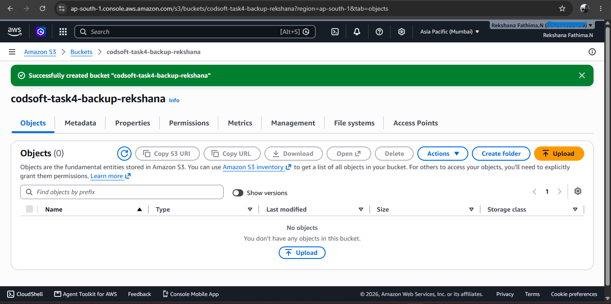
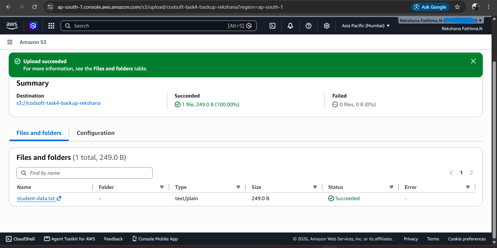
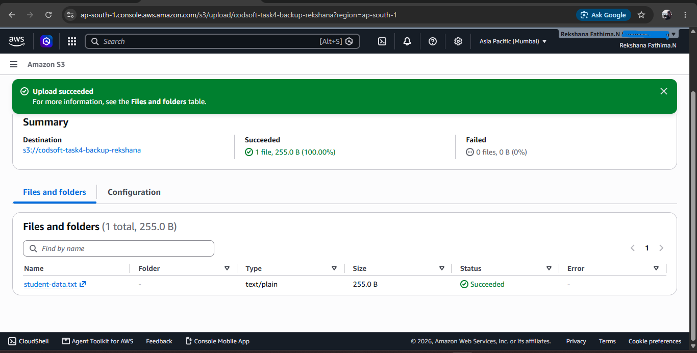
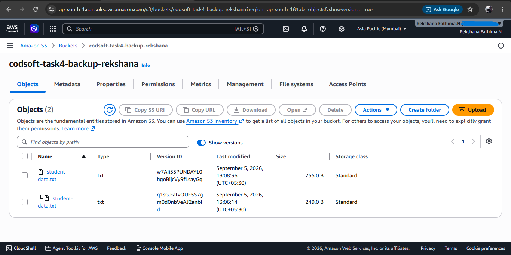
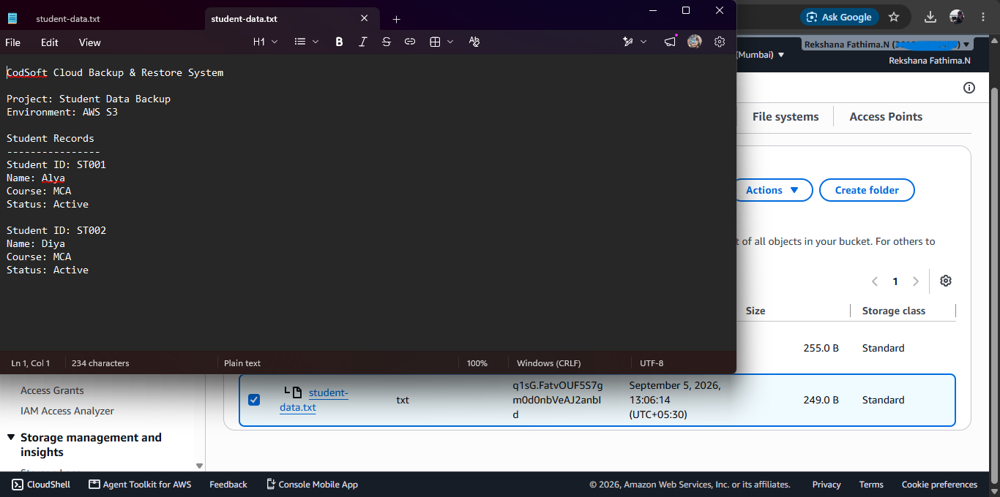
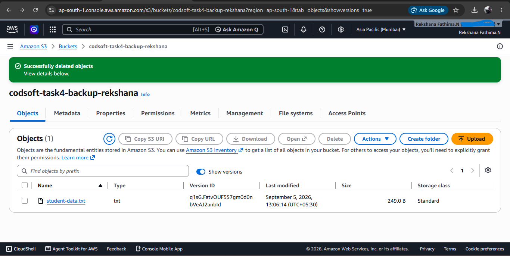
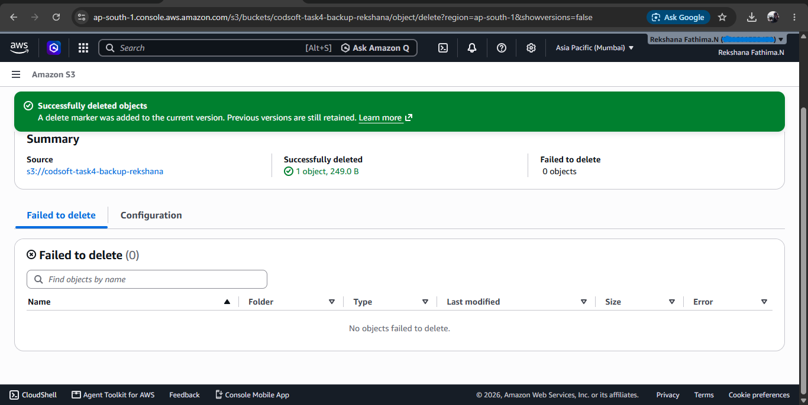
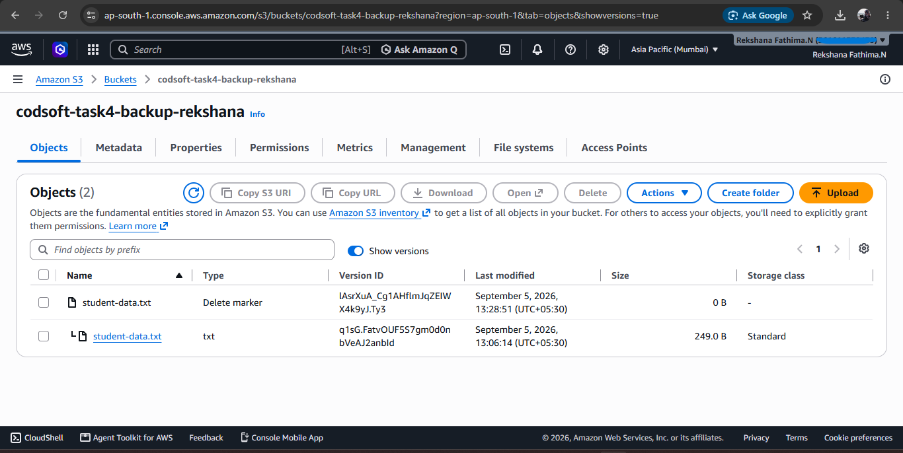
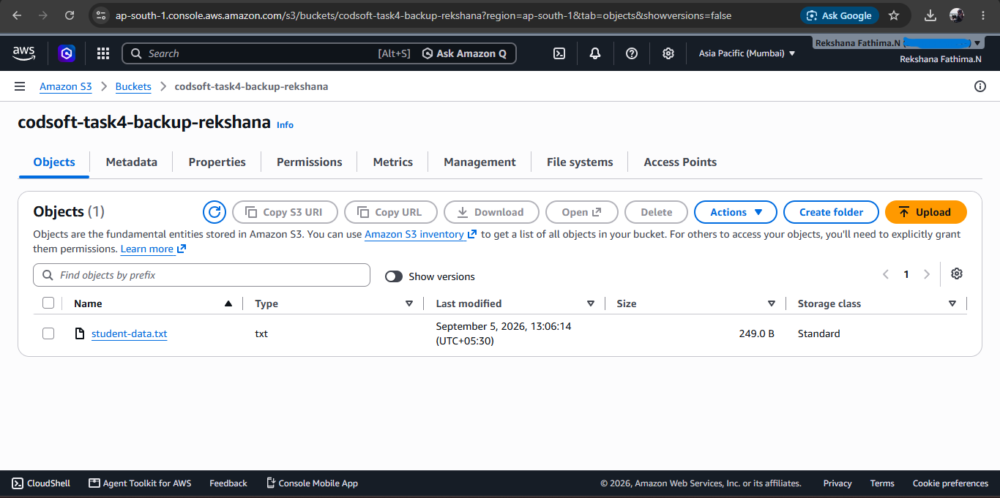

# Cloud Backup & Restore System

### Overview

This project demonstrates a simple cloud-based backup and restore system using Amazon S3.

The system uses S3 bucket versioning to maintain previous versions of a file and demonstrate data recovery after deletion.

The project focuses on understanding cloud storage, version management, backup handling, and data recovery using AWS.

---

## Architecture

The backup and restore workflow is:

Student Data File
        ↓
Amazon S3 Bucket
        ↓
S3 Versioning
        ↓
Multiple File Versions
        ↓
Simulated Data Deletion
        ↓
Previous Version Recovery
        ↓
Restored Data

---

## AWS Service Used

### Amazon S3

Amazon S3 is used to store the student data file and maintain different versions of the file.

### S3 Versioning

Bucket versioning was enabled to preserve previous versions of the uploaded object.

This allows an earlier version of the file to be recovered when a newer version is deleted.

---

## Implementation

### 1. S3 Bucket Creation

An S3 bucket named:

`codsoft-task4-backup-rekshana`

was created for the backup project.

---

### 2. Initial Backup Upload

A `student-data.txt` file containing sample student information was uploaded to the S3 bucket.

---

### 3. Updated Backup Upload

The student data file was updated and uploaded again to create another version of the same object.

---

### 4. S3 Versioning Verification

S3 versioning was used to maintain multiple versions of the uploaded file.

---

### 5. Backup Version Download

An earlier version of the student data file was downloaded and verified.

The downloaded version contained the original student data with:

`Status: Active`

---

### 6. Latest Version Deletion

The latest version of the file was deleted to simulate accidental data loss.

---

### 7. Object Recovery State

The S3 bucket was checked after the deletion to verify the remaining version of the file.

---

### 8. Delete Marker

S3 versioning maintains a delete marker when an object is deleted.

The delete marker and the previous object version were inspected during the recovery process.

---

### 9. Backup Restored

The delete marker was removed and the previous version became available again.

The restored student data was verified successfully.

---

## Backup and Restore Process

The project demonstrates the following workflow:

1. Create an S3 bucket.
2. Enable bucket versioning.
3. Upload the initial student data file.
4. Upload an updated version of the file.
5. View and download an earlier version.
6. Simulate data deletion.
7. Use S3 versioning to recover the previous data.
8. Verify the restored file.

---

## Result

The Cloud Backup & Restore System successfully demonstrated:

- Cloud-based file storage using Amazon S3.
- S3 bucket versioning.
- Multiple object versions.
- Backup version retrieval.
- Simulated data deletion.
- Recovery of previous data.
- Verification of restored data.

---

## Technologies Used

- Amazon S3
- S3 Versioning
- AWS Management Console

---

## Project Status

Completed successfully.
